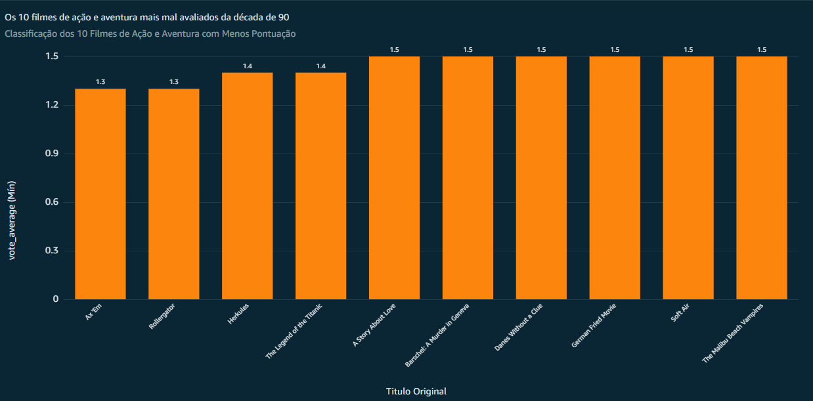

# Desafios

## Desafio da Sprint 9
[Desafio Sprint 9](Desafio/README.MD)

## Evidências

### Evidências do Desafio

1. **Gráfico Para Pergunta 1**
   Quais são os filmes de ação e aventura mais populares lançados a partir de 2014 com uma média de votos acima de 7?
   

2. **Gráfico Para Pergunta 2**
    Quais os filmes da década de 90 mais mal avaliados?
   

3. **Filtros**
   - Filtros Para Pergunta 1:
     
   - Filtros Para Pergunta 2:
     

4. **Dados**
     
