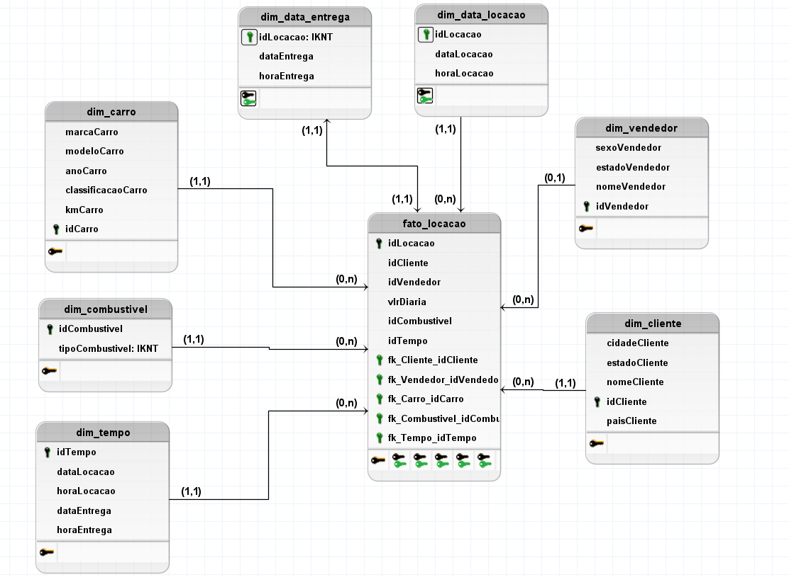
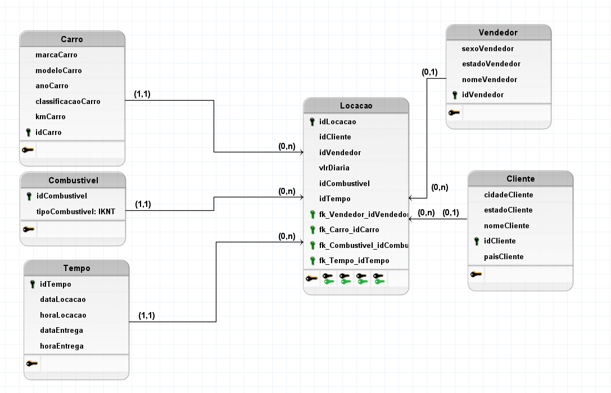

# Desafios

## Desafio da Sprint 2
[Desafio Sprint 2](/Sprint%202/Desafio/README.md)

## Exercícios

### Exercícios de SQL

- **Caso de Estudo: Biblioteca**  
  [Consultas SQL - Biblioteca](/Sprint%202/exercicios/casoBiblioteca/biblioteca_consultas.sql)

- **Caso de Estudo: Loja**  
  [Consultas SQL - Loja](/Sprint%202/exercicios/casoLoja/loja_consultas.sql)

## Evidências

- **Modelo Dimensional**  
  

- **Modelo Relacional**  
  

## Certificados

- **Certificado do Curso: AWS Skill Builder - AWS Partner**  
  
