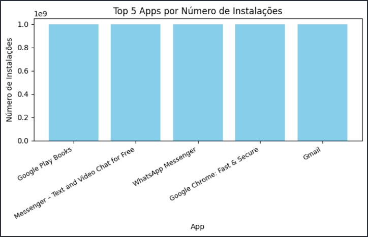
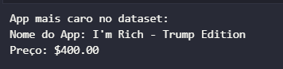
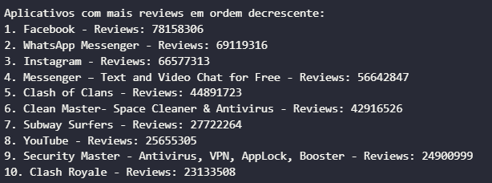
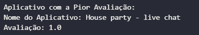
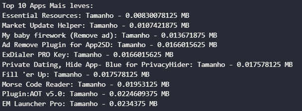
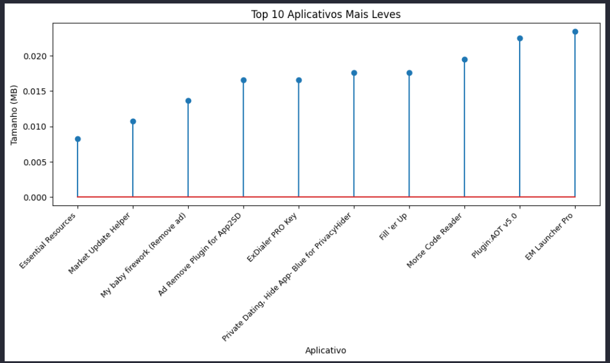
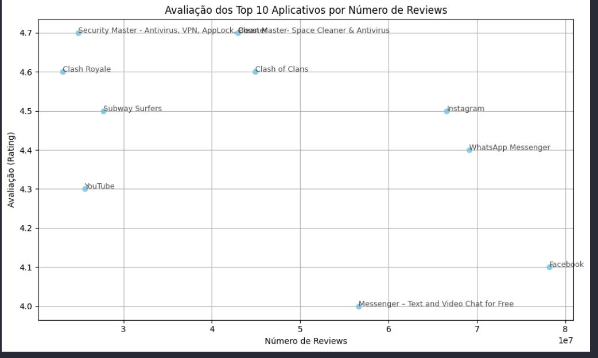

# Desafios

## Desafio da Sprint 3
[Desafio Sprint 3](/Sprint%203/Desafio/README.md)

## Exercícios

### Exercícios de Python

- [Exercícios Python](/Sprint%203/exercicios/exercicios_python.ipynb)
- [Exercício ETL](/Sprint%203/exercicios/exercicioEtl/README.md)

## Evidências

### Saídas do Desafio

- **Saída - Parte 1/2**  
  

- **Saída - Parte 3**  
  

- **Saída - Parte 4**  
  

- **Saída - Parte 5**  
  

- **Saída - Parte 6**  
  

- **Saída - Parte 7.1**  
  

- **Saída - Parte 7.2**  
  

- **Saída - Parte 8.1**  
  

- **Saída - Parte 8.2**  
  

## Certificados

- **Certificado do Curso: AWS Partner - Economias na Nuvem AWS**  
  
