# Desafios
Desafio da sprint 6
[Desafio Sprint 6](Desafio/README.md)

# Evidências

__Evidencias dos Desafio__

Criação do container
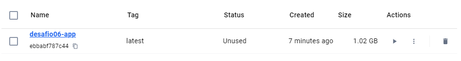

Após executar o contêiner
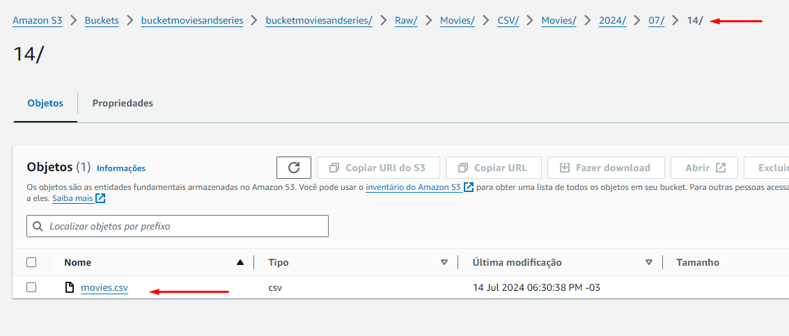

__Evidencias dos Exercicios__

1. Lab AWS S3

objetos inseridos
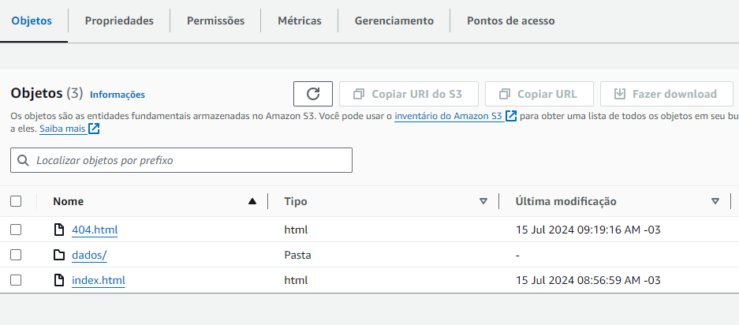

site estático configurado e rodando
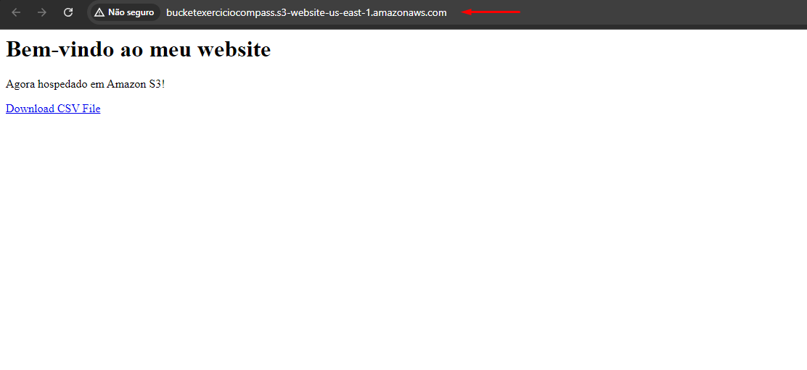

2. Lab AWS Athena

objetos inseridos
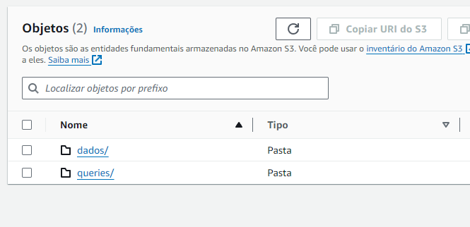

configuração do caminho para as queries
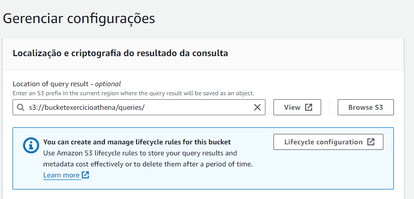

criação do banco de dados
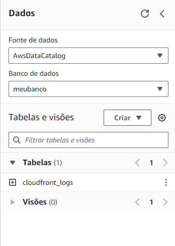

teste de consulta
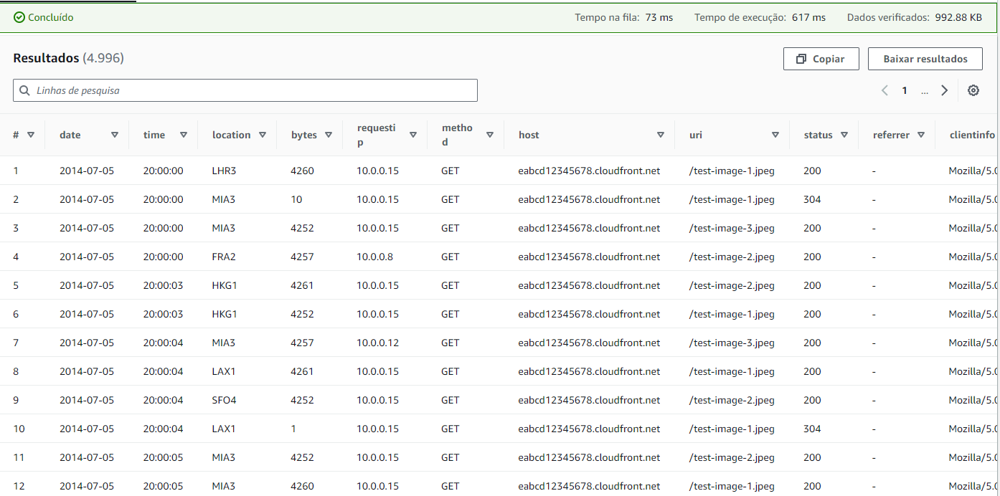

salvamento das queries
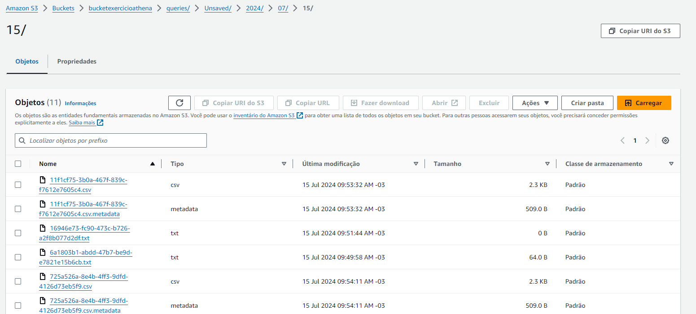

3. Lab AWS Lambda

criação do contêiner
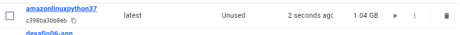

pasta compactada criada e salva no bucket s3
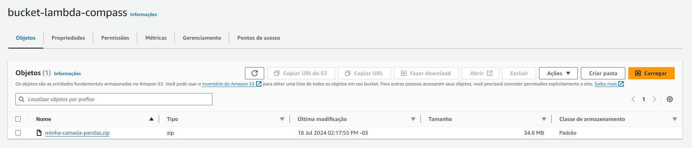

criação da layer
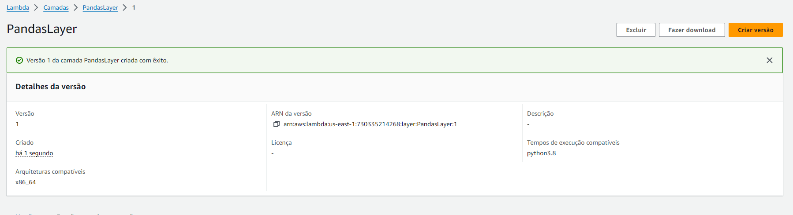

# Certificados

- Certificado do curso: Noções básicas de Analytics na AWS – Parte 1 
[Certificado](certificados/19345_5_5549227_1720437592_AWS%20Skill%20Builder%20Course%20Completion%20Certificate.pdf)

- Certificado do curso: Fundamentos de analytics na AWS – Parte 2
[Certificado](certificados/19359_5_5549227_1720440741_AWS%20Skill%20Builder%20Course%20Completion%20Certificate.pdf)

- Certificado do curso: Serverless Analytics
[Certificado](certificados/6256_3_5549227_1720825252_AWS%20Course%20Completion%20Certificate.pdf)

- Certificado do curso: Introduction to Amazon Athena
[Certificado](certificados/5838_3_5549227_1720825311_AWS%20Course%20Completion%20Certificate.pdf)

- Certificado do curso: AWS Glue Getting Started
[Certificado](certificados/8171_3_5549227_1720825401_AWS%20Course%20Completion%20Certificate.pdf)

- Certificado do curso: Amazon EMR Getting Started
[Certificado](certificados/8827_5_5549227_1720825498_AWS%20Skill%20Builder%20Course%20Completion%20Certificate.pdf)

- Certificado do curso: Amazon Redshift Getting Started
[Certificado](certificados/13655_3_5549227_1720825586_AWS%20Course%20Completion%20Certificate.pdf)

- Certificado do curso: Best Practices for Data Warehousing with Amazon...
[Certificado](certificados/6339_3_5549227_1720825896_AWS%20Course%20Completion%20Certificate.pdf)

- Certificado do curso: Amazon QuickSight - Getting Started
[Certificado](certificados/14908_3_5549227_1721319011_AWS%20Course%20Completion%20Certificate.pdf)