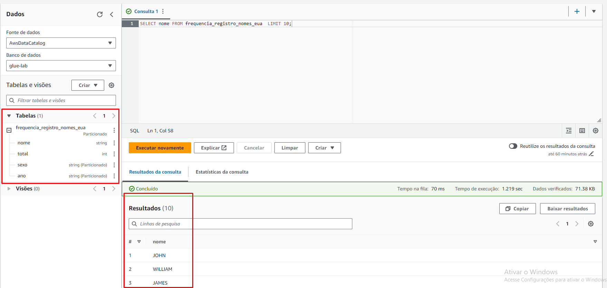

# Desafios
Desafio da sprint 7
[Desafio Sprint 7](Desafio/README.md)

# Evidências

__Evidencias dos Desafio__

Log da função lambda

Arquivos salvos no s3

Exemplo de JSON da consulta

__Evidencias dos Exercicios__

1. Spark

Criação do container

Inicialização do container

Função para pegar o Readme

Contagem das palavras

2. AWS Glue

Função do job 
[Evidencia 5](evidencias/job_aws.py)

Log da função

Arquivos salvos no s3 separados por sexo e ano

Consultas pós Crowler

