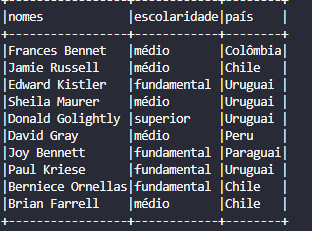

# Desafios

## Desafio da Sprint 8
[Desafio Sprint 8](Desafio/README.md)

## Evidências

### Evidências do Desafio

1. **Log do Job 1 (Dados do TMDB)**
   

2. **Log do Job 2 (Dados CSV)**
   

3. **Dados salvos na camada Trusted**
   - Dados TMDB em formato PARQUET:
     
   - Dados CSV em formato PARQUET:
     

### Evidências dos Exercícios

1. **Geração e Massa de Dados**
   - Lista de inteiros gerada:
     
   - Lista de animais criados:
     
   - Arquivos finais gerados:
     

2. **Apache Spark**
   - Tabela com nomes:
     
   - Tabela com nomes e escolaridade:
     
   - Tabela com nomes, escolaridade e país:
     
   - Tabela com ano de nascimento:
     
   - Contagem de millennials:
     
   - Consulta em SQL:
     
