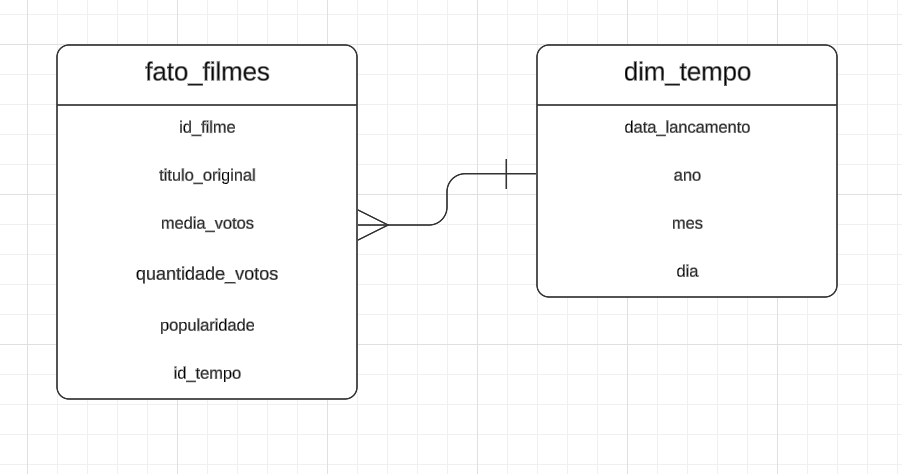
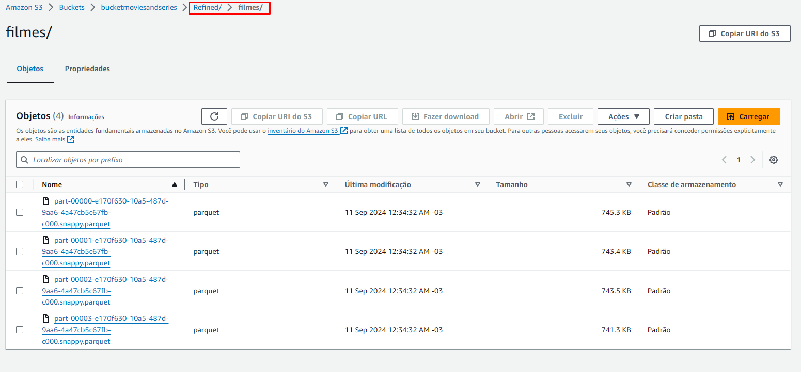
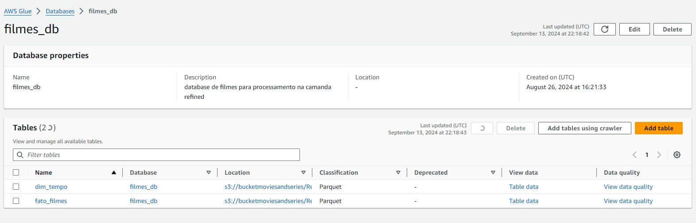
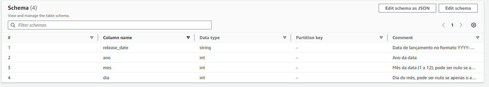
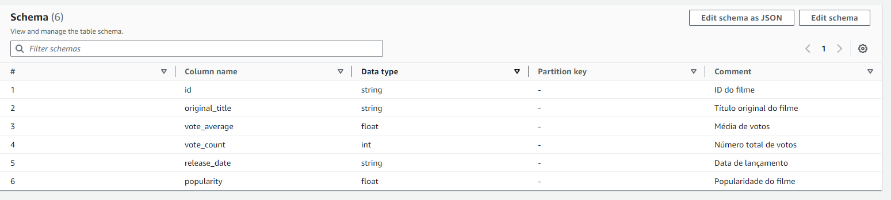
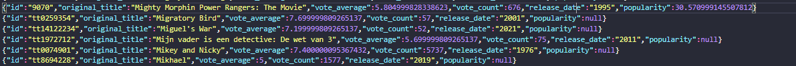

# Desafios

## Desafio da Sprint 9
[Desafio Sprint 9](Desafio/README.MD)

## Evidências

### Evidências do Desafio

1. **Modelo Dimensional**
   

2. **Dados no s3**
   
   
3. **Tabela de filmes**
   

4. **Schemas do BD**
   - Schema Dimensão tempo:
     
   - Schema Fato Filme:
     

5. **Dados no s3**
   

6. **Linhas de dados**
   
